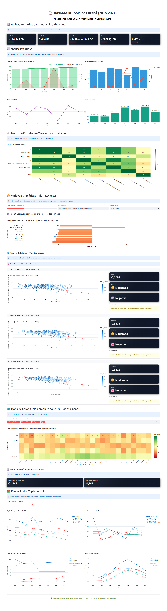

# Pipeline - Mineração de Dados de Clima e Soja no Paraná

##  Descrição

Pipeline completo para pré-processamento, limpeza e análise de dados de produção de soja no Paraná, integrando dados de múltiplas fontes:
- **NASA POWER**: Dados climatológicos e meteorológicos
- **IBGE (SIDRA)**: Dados de produção agrícola
- **PAM SIDRA**: Dados de produção agrícola municipal

##  Objetivo

Desenvolver um modelo preditivo para rendimento de soja baseado em variáveis climáticas e de produção no estado do Paraná.

##  Estrutura do Projeto

```
Pipeline_TCC/
├── src/
│   ├── preprocessing/          # Scripts de pré-processamento e extração de dados
│   │   ├── NASA_POWER.py      # Extração da API NASA POWER para CSV
│   │   ├── IBGE.py            # Extração da API IBGE para CSV
│   │   ├── PAM_SIDRA.py       # Conversão de XLSX para CSV
│   │   ├── NASA_POWER_agregation.py
│   │   └── merge.py           # Fusão de datasets
│   ├── analise_exploratoria/  # Notebooks de análise exploratória
│   ├── mining/                # Notebooks de Aprendizado de Máquina
│   └── dashboard/             # Dashboard interativo (Streamlit)
├── data/
│   ├── raw/                   # Dados brutos de APIs
│   ├── interim/               # Dados em processamento
│   └── processed/             # Dados finais processados
├── references/                # Dados de referência (atributos, etc)
├── requirements.txt           # Dependências Python
├── Dockerfile                 # Configuração Docker
├── docker-compose.yml         # Orquestração de containers
└── README.md                  # Este arquivo
```

##  Instalação

### Pré-requisitos
- Docker

### Passos

1. **Clonar o repositório**
   ```bash
   git clone https://github.com/Bruno-P-d-E/mineracao-de-dados-clima-soja-parana.git
   cd mineracao-de-dados-clima-soja-parana
   ```

2. **Criar ambiente virtual**
   ```bash
   python -m venv venv
   source venv/bin/activate  # Linux/Mac
   # ou
   venv\Scripts\activate  # Windows
   ```

3. **Instalar dependências**
   ```bash
   pip install -r requirements.txt
   ```

##  Uso

### Pré-processamento de Dados

#### Extração de dados NASA POWER
```bash
python src/preprocessing/NASA_POWER.py
```

#### Extração de dados IBGE
```bash
python src/preprocessing/IBGE.py
```

#### Extração de dados PAM SIDRA
```bash
python src/preprocessing/PAM_SIDRA.py
```

#### Agregar dados climatológicos
```bash
python src/preprocessing/NASA_POWER_agregation.py
```

#### Mesclar datasets
```bash
python src/preprocessing/merge.py
```

### Análise Exploratória

Os notebooks de análise estão em `src/analise_exploratoria/`:

#### Dashboard Interativo

```bash
streamlit run src/dashboard/dashboard.py
```


### Mineração de Dados

Os notebooks de análise estão em `src\mining`:

`src\mining\supervised.ipynb`

`src\mining\unsupervised.ipynb`

##  Dados

Os dados são organizados em:
- `data/raw/` - Dados brutos de APIs
- `data/interim/` - Dados parcialmente processados
- `data/processed/` - Dataset final (`dataset_final.csv`)

##  Docker

Para executar em container:

```bash
docker-compose up -d
```


##  Notas

- Arquivos CSV grandes estão no `.gitignore`
- Use `docker-compose` para consistência entre ambientes

##  Autor

Bruno Proença de Souza

##  Licença

Copyright (C) 2026 Bruno Proença de Souza
Licenciado sob GNU AGPL v3 - Veja o arquivo LICENSE


